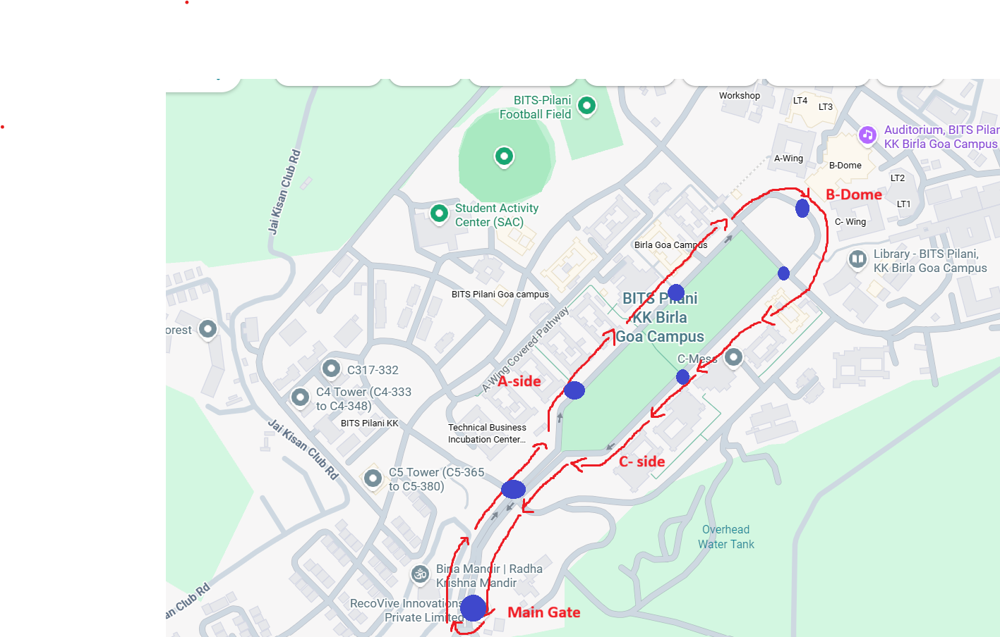

# Autonomous Golf Cart AI Assistant

A state-aware, safety-constrained AI agent for an autonomous campus golf cart. The system answers spoken passenger queries using live cart metadata, while ensuring all responses are grounded, temporally correct, and safety-first.

This is **not a chatbot**. The language model is deliberately constrained and embedded inside a deterministic runtime system that owns all physical state and safety decisions.

---

## Route Map

The campus route below represents the physical world model used by the system.  
Stop coordinates were derived from real campus locations and converted into a relative coordinate frame with the Main Gate as the origin.


<p align="center">
  
</p>

---


## Features

* Offline, real-time voice interaction
* Deterministic cart simulation with live telemetry
* Semantic finite state machine for safety-aware reasoning
* Constrained LLM for natural language explanations
* Push-to-talk speech input and non-blocking speech output
* Automatic rejection of stale or unsafe AI responses

---

## Architecture

```
config/route.json      # Static world model
        ↓
live_data.py           # Simulation + system orchestrator
        ↓
fsm.py                 # Deterministic semantic state
        ↓
llm_explainer.py       # Constrained LLM reasoning
        ↓
tts.py                 # Speech output

User Speech → asr.py → live_data.py
```

Information flows in one direction only. The LLM never controls motion, state, or safety.

---

## Why This Is an AI Agent

The system qualifies as an AI agent because it:

* Perceives its environment (cart telemetry + user speech)
* Maintains internal state (semantic FSM)
* Reasons over observations (LLM under constraints)
* Acts through speech output
* Operates toward a clear goal: safe and correct passenger interaction

The agent is advisory only and does not control the vehicle.

---

## Design Philosophy: Deterministic + LLM

* **Deterministic layers** handle truth, safety, timing, and state transitions
* **LLM layer** handles language understanding and natural phrasing

Anything that affects safety or correctness is deterministic. The LLM is used only where flexibility is needed.

---

## File Overview

### `config/route.json`

Static campus map and route definition using real, map-derived relative coordinates.

### `live_data.py`

System orchestrator. Simulates motion, computes telemetry, coordinates ASR/LLM/TTS, and enforces safety gates.

### `fsm.py`

Deterministic finite state machine mapping raw telemetry to semantic states:

* `STOPPED_AT_STOP`
* `MOVING_BETWEEN_STOPS`
* `APPROACHING_STOP`

### `asr.py`

Push-to-talk speech recognition using offline `faster-whisper`. Treats speech as a sensor.

### `llm_explainer.py`

Constrained LLM reasoning layer using an offline Ollama-hosted model (`gpt-oss:20b-cloud`). Produces short, safety-aware responses.

### `tts.py`

Offline text-to-speech with normalization and asynchronous playback.

---

## Safety Guarantees

The assistant will never:

* Contradict the cart’s real state
* Invent stops, obstacles, or actions
* Give unsafe instructions while moving
* Speak stale or temporally incorrect information
* Ramble beyond a couple of sentences

---

## Running the Project

```bash
python live_data.py
```

Controls:

* Hold **SPACE** to speak
* Release **SPACE** to submit a query
* Press **Ctrl+C** to exit

---

## Summary

This project demonstrates how large language models can be safely embedded into real-time autonomous systems by pairing them with deterministic state modeling, strict orchestration, and explicit safety constraints.
